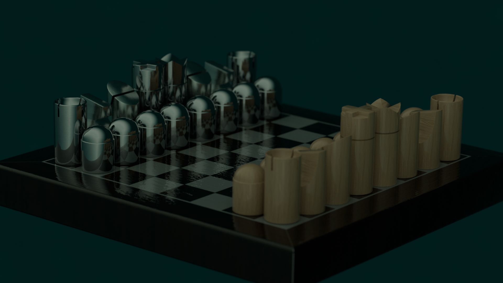

# Ultra Mat ~ BOTW - Chess

Creation of a fictitious project in one week for the [Brief Of The Week](https://briefweek.fr/)

Website: **[botw-chess.namide.com](https://botw-chess.namide.com/)**  
View the [brief](./doc/brief.pdf)

## Credits

|  |  |  |
| --- | --- | --- |
| Designer | [Alan](https://super8studio.eu/) |  |
| Developer | [Damien](https://damien-doussaud.com/) |  |
| Chess engines | Stockfish |
| Render engine | Three.js |
| Materials | polycount |
| Inspiration | Louis Berger |

## Tools

- [Notation Forsyth-Edwards](https://fr.wikipedia.org/wiki/Notation_Forsyth-Edwards)
- Positions https://www.chess.com/
